2020년 방혜원 졸업작품

with lgsvl simulator(2019.03v) 
:sunglasses: https://github.com/lgsvl/simulator-2019.05-obsolete/releases/tag/2019.03

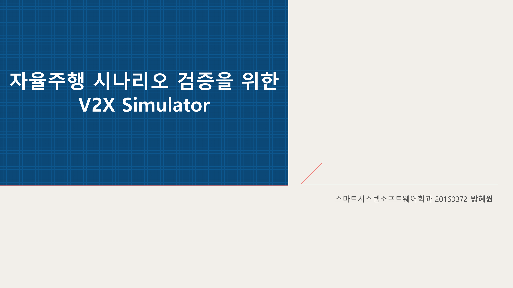

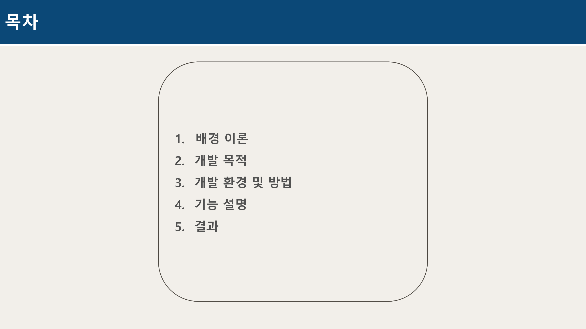

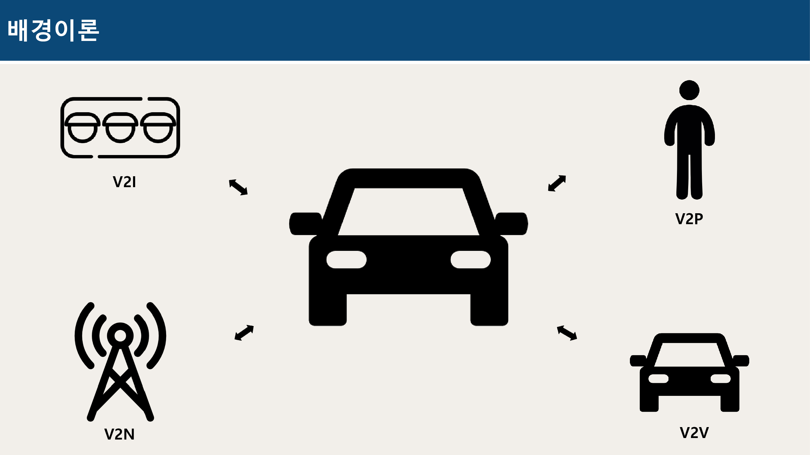
:memo: 
V2X 기술은 미래의 자율주행자동차를 위한 기반 무선통신 기술로써, 자율주행 인프라 구축에 있어 매우 중요한 기술이다. 
V2X는 센서의 거리 제약조건에 구애 받지 않는 환경인식 능력을 제공하며, 열악한 환경에서도 환경정보의 제공이 가능하다.

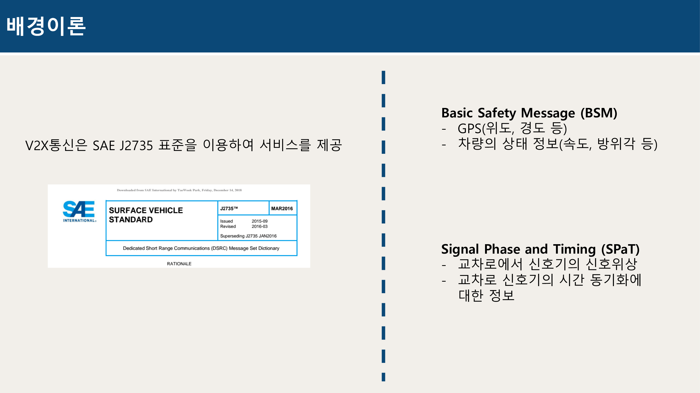
:memo:
V2X통신은 SAE J2735 표준의 Basic Safety Message(BSM)를 통해 안전서비스를 제공한다.
Signal Phase and Timing(SPaT), SPaT 메시지는 신호등의 상태정보를 포함하고 있다. 
BSM 메시지는 GPS(위도, 경도 등), 차량의 상태 정보(속도, 방위각 등)의 정보를 포함하고 있다. (100ms)

SAE J2735 표준은 DSRC 어플리케이션 간 상호 운용을 지원하기 위해 만들어졌다. BSM 메시지란 안전 메시지를 통해 안전 정보를 제공한다.

ASN.1은 네트워크상의 데이터 교환을 정의한 프로토콜 단순히 표준을 정의하는 언어이다.
ASN.1이 표준이 아닌 ASN.1로 작성된 데이터가 표준

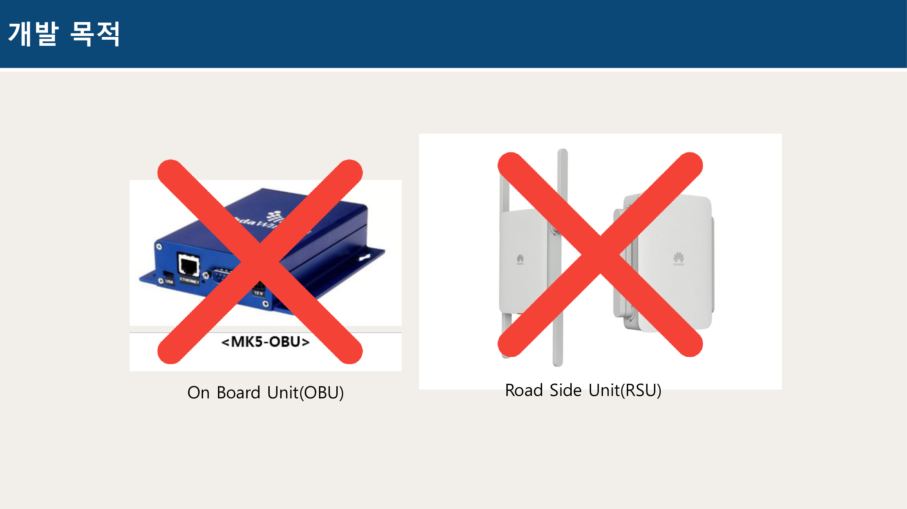
V2X메시지는 도로에 설치된 RSU와 차량에 설치하는 OBU의 TCP혹은 UDP통신을 통하여 취득할 수 있다. 
실시간으로 V2X 정보를 취득하기 위해서는 RSU가 있는 도로로 나가야만 하는 어려움이 있다. 
매 순간 디버깅을 위해 밖으로 나가기는 힘들다. 또한, 언제나 OBU, RSU와 같은 장비를 우리는 가지고 있을 수 없다. 그래서 환경정보를 broadcasting해주는 RSU와 그 정보를 받아들이는 OBU 장치 없이 simulation을 진행할 수 있는 환경을 만들고자 하였다.
물론 .pcapng로 V2X message를 캡쳐를 해 올 수는 있지만 이는 실시간성을 보장하지 못하고, 실시간으로 simulation을 하는데에는 어려움이 있다.

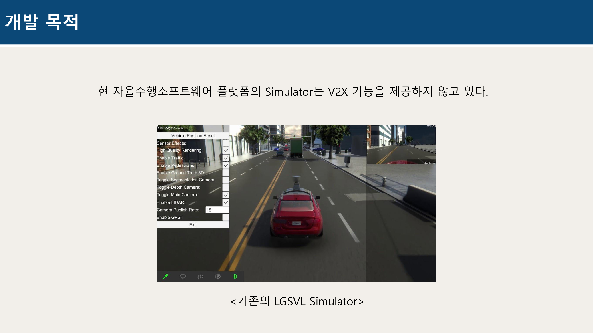
현 자율주행소프트웨어 플랫폼의 Simulator는 V2X 기능을 제공하지 않고 있다. 
이를 위해 ‘V2I’와 ‘V2V’ 기능을 구현하고, LGSVL Simulator상에 SPaT, BSM등 V2X 기능을 추가하는 하였다. 

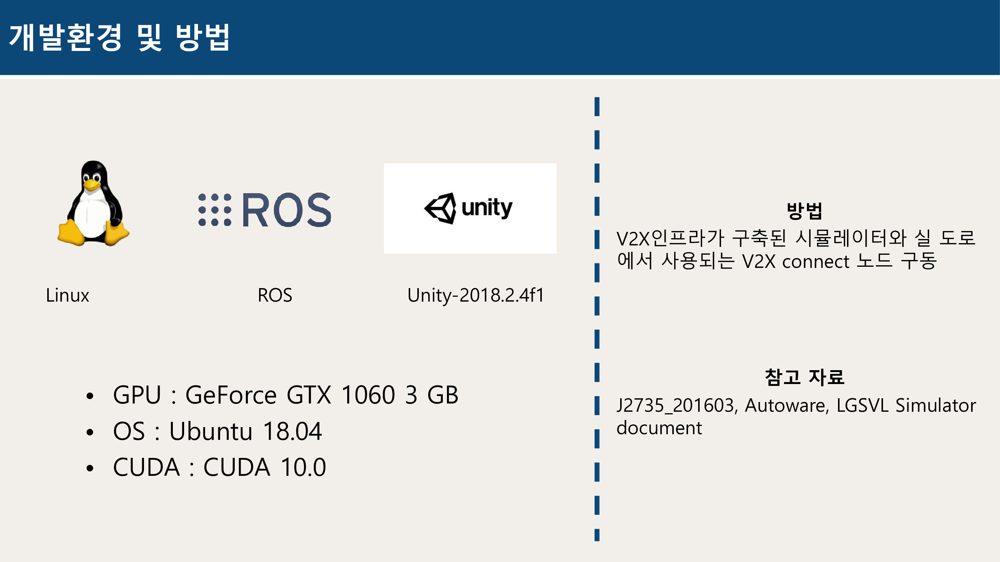

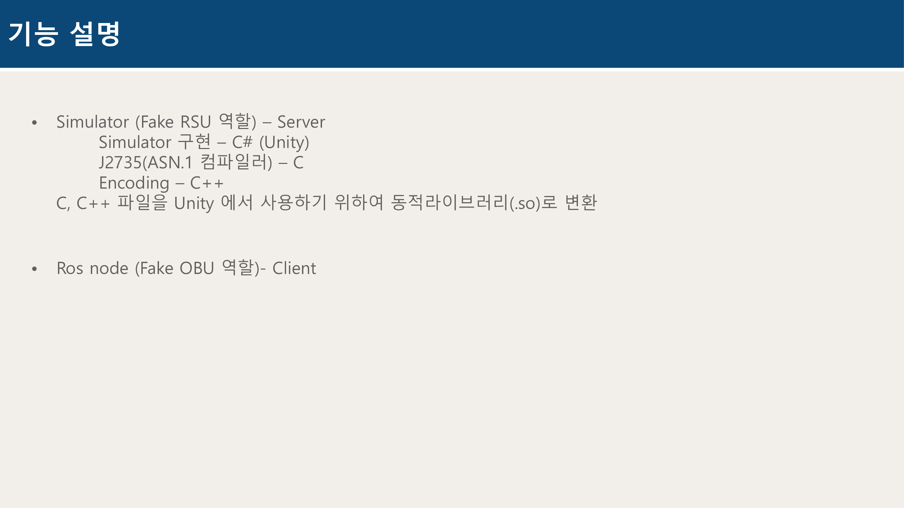
Simulator는 Server로 Fake RSU역할을 한다. 
Simulator는 Unity로 구현하여 C#으로 구현되어있다. J2735는 기본적으로 C코드로 되어있고, J2735를 사용하는 Encoding 프로그램도 C++로 구현하였다. 
Unity에서 C, C++파일을 그대로 사용할 수 없었기 때문에 동적라이브러리(.so)로 변환하여 내부 함수를 사용할 수 있도록 하였다.  
ROS node는 Client로 Fake OBU역할을 합니다. 이는 ROS 노드이고, C++로 구현되어 있다. 

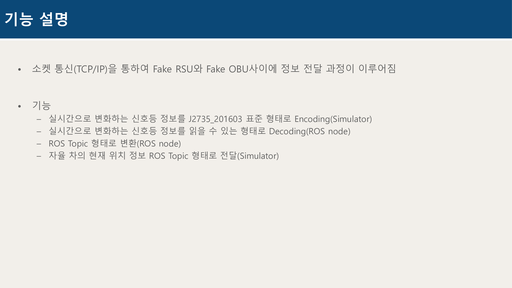
소켓통신을 통하여 FakeRSU와 Fake OBU사이에 정보 전달 과정이 이루어 진다. 
Simulator에서는 실시간으로 변화하는 신호등 정보를 J2735표준 형태로 Encoding을 한다. 
이렇게 인코딩 된 정보를 ROS 노드에서 J2735표준으로 Decoding을 한다. 또한 자율주행을하는데 사용될 수 있도록 ROS Topic형태로 출력을 하였다.

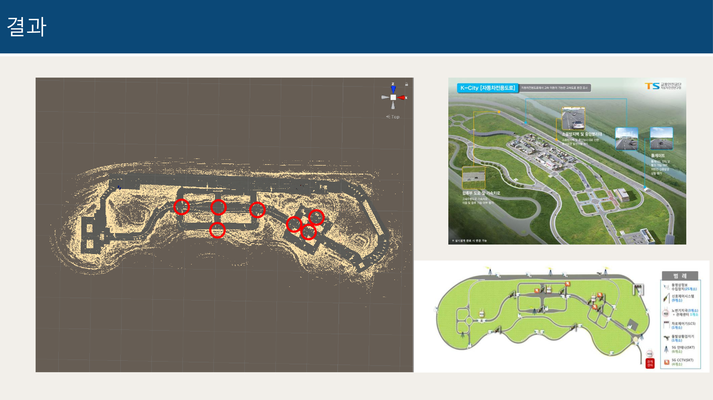
V2X 통신을 위하여 도로인프라를 구축하였다. 
다음사진은 화성에 있는 자율주행테스트를위해 사용되는 자율주행 도로 K-city. 
실제와 같은 시뮬레이션을 위하여 도로를 동일하게 만들고, 실제 신호등 위치와 동일한 곳에 신호등을 설치 하였다.
사진에 보이는 빨간색 동그라미가 신호등이 위치한 교차로를 의미한다.

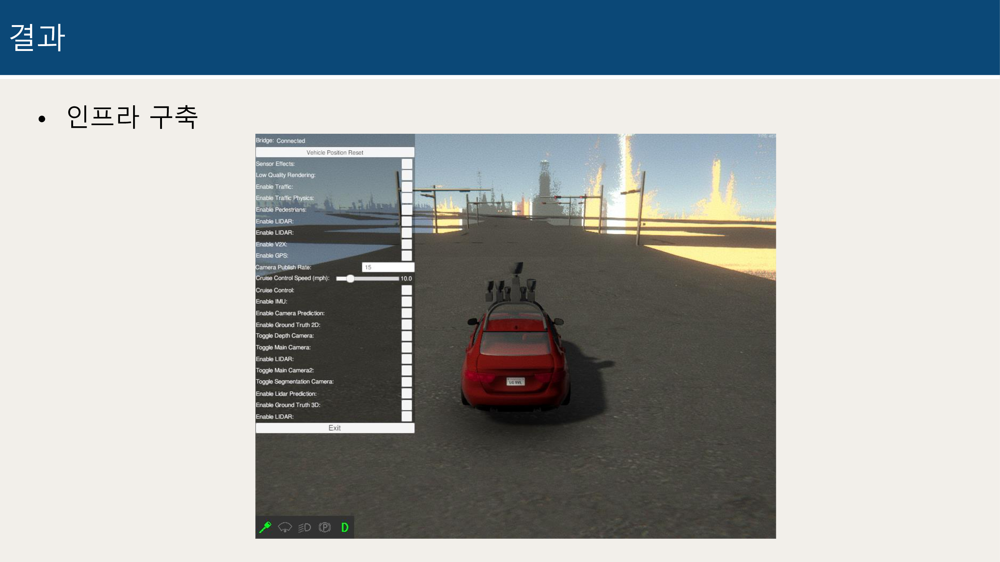
:heavy_check_mark: Simulator구동시 실제로 보이는 화면

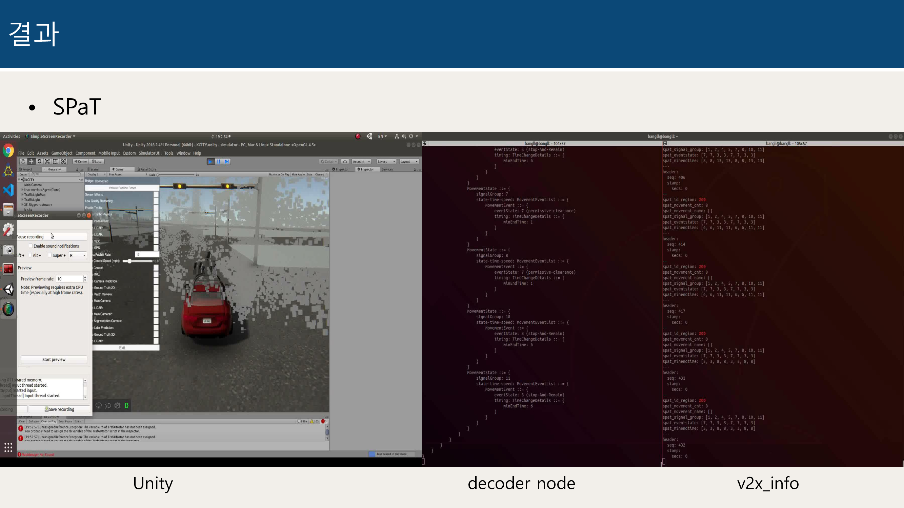

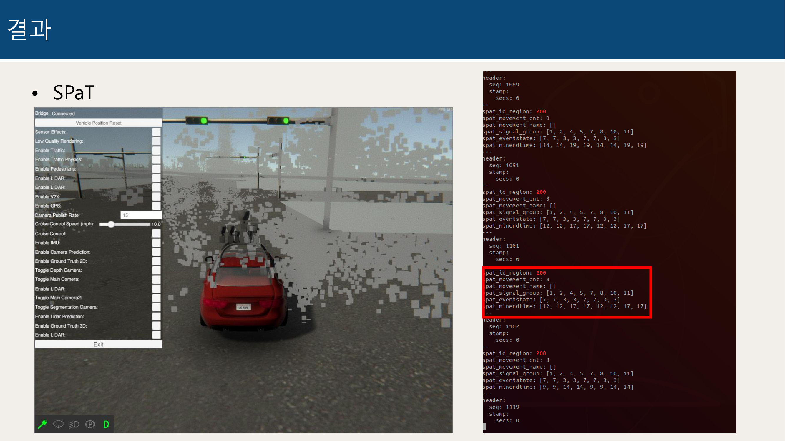

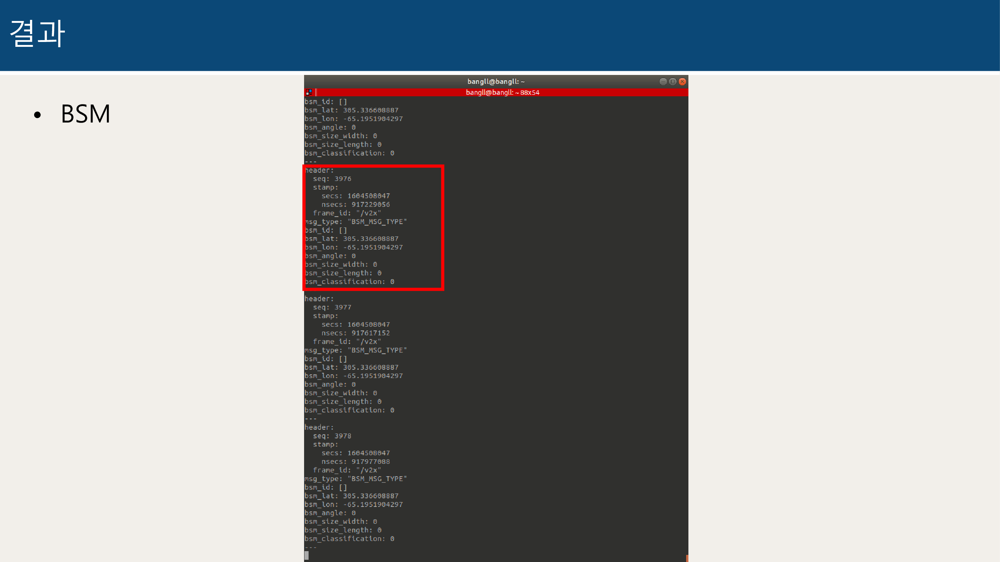

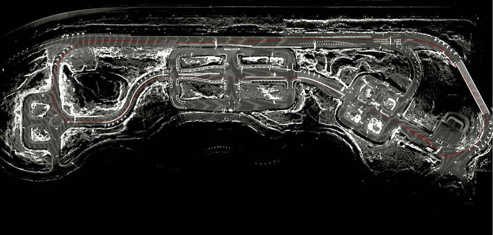
:heavy_check_mark: 주행 경로를 rviz를 이용하여 확인한 사진 1

:heavy_check_mark: 주행 경로를 rviz를 이용하여 확인한 사진 2
